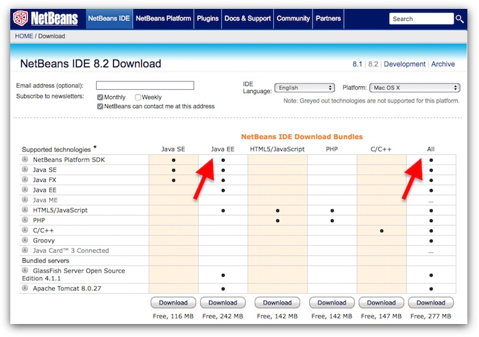
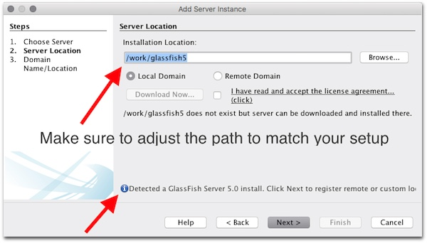
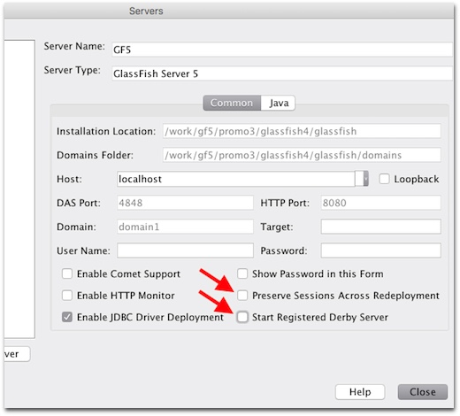
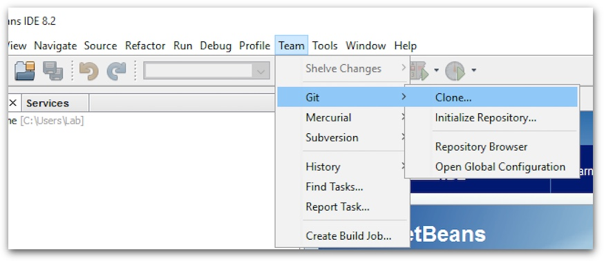
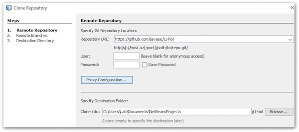
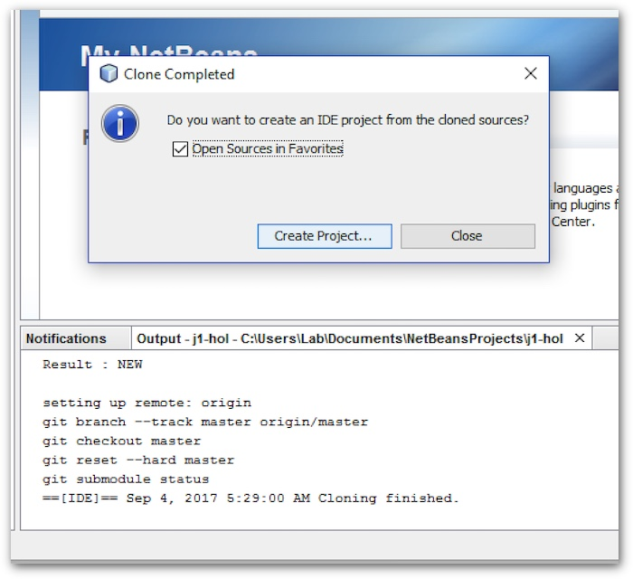
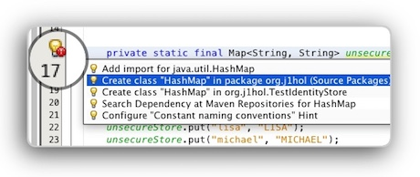

# Jakarta EE Hands-On Lab

## Table of contents

* [Initial setup](#initial-setup)
* [Exercise 1 : JSON-B 1.0 and Bean Validation 2.0](ex-jsonb-beanval.md)
* [Exercise 2 : Jakarta EE Security API](ex-security.md) 
* [Exercise 3 : JAX-RS 2.1 and CDI 2.0](ex-jaxrs-cdi.md)
* [Credits](#Credits)


## Initial setup

During this "Bring Your Own Laptop" Lab, you will use NetBeans 8.2 and GlassFish 5, the open source Jakarta EE reference implementation to test some Jakarta EE 8 APIs. 

### Install Java SE 8 JDK

:bulb: Jakarta EE requires Java SE 8 or above. For Oracle Code One, we will use the latest JDK 8 release.

:warning: Jakarta EE requires the JDK not just a JRE!

:warning: GlassFish 5.0 is today only supported on Java SE 8; do not use Java SE 9/10/11! GlassFish 5.0.1 will add support Java SE 9.

If you don't have a recent JDK 8 installed on your laptop, download and install [Java SE 8 Development Kit 8u144](http://www.oracle.com/technetwork/java/javase/downloads/jdk8-downloads-2133151.html).


### Install GlassFish

Download the [final version of GlassFish 5.0](http://download.oracle.com/glassfish/5.0/release/glassfish-5.0.zip). To install it, just unzip the archive into a target directory. Take a moment to note the directory where GlassFish 5 is installed as this path will be required in the next step.

You can now start GlassFish 5...
```
cd glassfish5
bin/asadmin start-domain domain1
```

After a few seconds, you should see the following...
```
Waiting for domain1 to start ......
Successfully started the domain : domain1
domain  Location: /Users/davidd/work/glassfish5/glassfish/domains/domain1
Log File: /Users/davidd/work/glassfish5/glassfish/domains/domain1/logs/server.log
Admin Port: 4848
Command start-domain executed successfully.
```

You can now connect to the GlassFish Admin Console on [http://localhost:4848](http://localhost:4848).

### Install and configure NetBeans

If you have NetBeans 8.2 with Java EE support already installed on your machine, you can go directly to the NetBeans configuration step.

### Install NetBeans

Download [NetBeans 8.2](https://netbeans.org/downloads/), make sure to download the *"Java EE"* bundle (*"All"* will also work). You can now install and launch NetBeans.



### Configure NetBeans

NetBeans 8.2 comes with GlassFish 4.x (Java EE 7), we will now reconfigure NetBeans to use GlassFish 5 (Jakarta EE / Java EE 8) instead.

In NetBeans, select *"Services"* tab, *"Servers"* and right click to select *"Add Server..."*; this will open an *"Add Server Instance"* window. Name your instance, ex. *"GlassFish 5"* and click *Next*. Now in the install location, enter the directory where you have installed GlassFish 5 (see previous step). If everything goes well, NetBeans will confirm that a GlassFish 5.0 installation was found, you can now click *"Next"* and *"Finish"* to accept the default values.



You should now see your *"GlassFish 5"* instance under *"Servers"*. Right click on it, you can now *"Start"* it if it is not started yet. After a few seconds you should see that GF5 is started in the NetBeans Output window at the bottom. 

You can also connect to the GF Admin console ([http://localhost:4848](http://localhost:4848)] to confirm that GF is up and running.

:bulb: If the *"Start"* option is greyed, just wait a few seconds or select 
*"Refresh"* first.


:bulb: When running a project, NetBeans will ask you which server you want to deploy this project on; make sure to always select *"GlassFish 5"* or set it as the default server.

:bulb: GlassFish comes with a bundled database (Java DB aka Derby). Given that we are not using it, you can disable it to save a few cycles. Just right click on your GlassFish 5 instance, select *"Properties"* and make sure to disable the *"Start Registered Derby Server"* option. For our tests, it is also preferable to disable the *"Preserve Sessions Across Redeployment"* feature.




### Clone the Lab GitHub repository

The only thing you have to do is to clone the Lab GitHub repository on your machine.

In NetBeans, choose *"Team", "Git", "Clone..."*



... and enter the URL (https://github.com/dheffelfinger/j1-hol.git) of the Lab GitHub repository to clone as below, keep the other default values.



Select *"Open Sources in Favourites"* and *"Finish"*. You can check the clone operation in the "Output" windows, the cloned repository should also appear under the *"Favourites"* tab.



:bulb: Sometime when you will add code, NetBeans will complain (e.g. some "imports" are missing). Simply click on the yellow bulb on the left side of the code and NetBeans will, most of the time, provides you with suggestions on how to fix the issue.



You are now all set to do the [first exercise](ex-jsonb-beanval.md)!


## Credits

This Jakarta EE 8 Hands-on-Lab was originally developed by [David Delabassee](https://twitter.com/delabassee) (Java EE Evangelist, Oracle), [David Heffelfinger](https://twitter.com/ensode) (Principal Consultant, Ensode Technology, LLC) and [Michael Nascimento Santos](https://twitter.com/mr__m) (CEO, Improving) for JavaOne 2017. Updated by [David Heffelfinger](https://www.twitter.com/ensode) and [Bob Larsen](https://twitter.com/direHerring) for Oracle Code One 2018.
