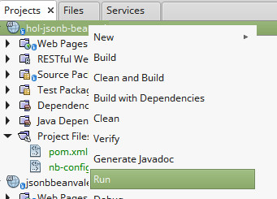
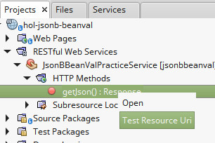

# Bean Validation / JSON-B exercise

## Initial setup

In this exercise, we will use [Bean Validation 2.0](http://beanvalidation.org/) to validate a collection of objects. We will also use [JSON-B](http://json-b.net/) to generate a JSON string from a collection of Java objects.

Start a new Maven project and select *"Web Application"* and give it a meaningful name, ex. *"hol-jsonb-beanval"*, click *"Next"*.

Select *"GlassFish"* as the application server and *"Java EE7 Web"*, we will update the Java EE API version later. Validate and you should now have an empty project.

Select the project's *pom.xml*, under *"Project Files"*. Now you can update the project to use Java EE 8 APIs but just updating the version number of the *<javaee-web-api>* dependency.

```xml
 <dependency>
    <groupId>javax</groupId>
    <artifactId>javaee-api</artifactId>
    <version>8.0</version>
    <scope>provided</scope>
 </dependency>
```

Additionally, set up the project to use Java 8

```xml
<plugin>
    <groupId>org.apache.maven.plugins</groupId>
    <artifactId>maven-compiler-plugin</artifactId>
    <version>3.1</version>
    <configuration>
        <source>1.8</source>
        <target>1.8</target>
        <compilerArguments>
            <endorseddirs>${endorsed.dir}</endorseddirs>
        </compilerArguments>
    </configuration>
</plugin>
```

:bulb: This Lab is only using APIs from the Java EE 8 Profile which is a subset of the Full platform.

## Create a JAX-RS Web service

Right click on the project, select *"New"* and *"Java Class"*, enter an appropriate class name, eg. *"JsonBBeanValPracticeService"*. Make sure to specify a package where you code will reside, eg. *"org.j1hol"* then *"finish"*.  

Annotate your class with the `@Path` annotation, specifying an appropriate path for our web service, eg. `@Path("jsonbbeanval")`.

:bulb: Add all missing imports by hitting `CTRL+SHIFT+I`.

NetBeans will warn that REST is not configured, click on the class name and hit `Alt+Enter`, then select "Configure REST using Java EE 6 Specification".


Add a public method named `getJson()` to your class, the method should be public, take no arguments, and return `javax.ws.rs.core.Response`

Annotate your method with the `@GET` annotation to have the method respond to HTTP GET requests.

Annotate your method with the `@Produces` annotation, specifying `MediaType.APPLICATION_JSON` as the value attribute of the annotation.

At this point your method should look like this:

```java
    @GET
    @Produces(MediaType.APPLICATION_JSON)
    public Response getJson() {
    }
```
Add a `Customer` class to your project (Right click on the project, select *"New"* | "*Java Class*"). This class will be used as a Data Transfer Object (DTO), its contents should look as follows (copy/paste into your class):

```java
    package org.j1hol;

    import javax.validation.constraints.NotBlank;
    import javax.validation.constraints.PositiveOrZero;

    public class Customer {

        private String salutation;

        @NotBlank(message = "first name must not be empty")
        private String firstName;
        private String middleName;

        @NotBlank(message = "last name must not be empty")
        private String lastName;

        @PositiveOrZero
        private Integer age;

        public Customer() {
        }

        public Customer(String salutation, String firstName, String middleName, String lastName, Integer age) {
            this.salutation = salutation;
            this.firstName = firstName;
            this.middleName = middleName;
            this.lastName = lastName;
            this.age = age;
        }

        public String getSalutation() {
            return salutation;
        }

        public void setSalutation(String salutation) {
            this.salutation = salutation;
        }

        public String getFirstName() {
            return firstName;
        }

        public void setFirstName(String firstName) {
            this.firstName = firstName;
        }

        public String getMiddleName() {
            return middleName;
        }

        public void setMiddleName(String middleName) {
            this.middleName = middleName;
        }

        public String getLastName() {
            return lastName;
        }

        public void setLastName(String lastName) {
            this.lastName = lastName;
        }

        public Integer getAge() {
            return age;
        }

        public void setAge(Integer age) {
            this.age = age;
        }

    }
```
:bulb: Notice the Bean Validation annotations on the class.

Add a private variable of type `List` to your web service class (`JsonBBeanValPracticeService`), using generics, specify that the list will accept only instances of the `Customer` class we just created, annotate the type of the parameterized type with Bean Validation's `@Valid` annotation.

```java
private List<@Valid Customer> customerList;
```

Add a private method to populate the List of customers, as follows:

```java
private void populateCustomerList() {
    customerList = new ArrayList<>();

    customerList.add(new Customer("Mrs", "Trisha", null, "Gee", 20));
    customerList.add(new Customer("Dr", "James", null, "Gosling", 30));
    customerList.add(new Customer("Mr", "Don", null, "Smith", -10));
}

```

:bulb: Notice the third element on the list has an invalid age, which should trigger a validation error.

Add an invocation to the `populateCustomerList()` method to the `getJson()` method.

```java
@GET
@Produces(MediaType.APPLICATION_JSON)
public Response getJson() {
    populateCustomerList();
}
```

Inject an instance of `javax.validation.Validator` to your web service class.

```java
@Inject
private Validator validator;
```

:bulb: NetBeans will warn about an unsatisfied injection point, this warning can be safely ignored.

Add a local variable of type `javax.ws.rs.core.Response` to your `getJson()` method.

```java
Response response;
```

Add code to validate all elements on the list by invoking the `validate()` method on the injected `Validator`.

```java
Set<ConstraintViolation<List<Customer>>> constraintViolations = validator.validate(customerList);
```
Check to see if there are any constraint violations, if so, iterate through them and send the corresponding error messages to the GlassFish log, then set the value of the Response variable so that it indicates a server error.

```java
if (!constraintViolations.isEmpty()) {
    constraintViolations.forEach(
            constraintViolation -> System.out.println(constraintViolation.getMessage()));

    response = Response.serverError().build();
} 
```

Add a local variable of type `javax.json.bind.Jsonb` to the `getJson()` method, initialize it by invoking the `create()` method on `javax.json.bind.JsonbBuilder`.

```java
Jsonb jsonb = JsonbBuilder.create();
```

If there are no constraint violations, add an `else` statement to the conditional above, inside it, build a JSON string from the Customer list using the JSON-B API, then build a "success" response that sends the generated JSON string to the client.

```java
else {
    String json = jsonb.toJson(customerList);
    response = Response.ok(json).build();
}
```
Return your `Response` variable from your `getJson()` method.

```java
return response;
```

Deploy your project by right clicking on it and selecting *"Run"*



:bulb: A "Hello World" page will pop up in the browser, this page is automatically generated by NetBeans and can be safely ignored.

Test your web service by expanding *"RESTful Web Services | JsonBBeanValPracticeService | HTTP Methods | getJson(): Response"*, then right click *"Test Resource URI"*



Did you get the result you were expecting? Why or why not?

One "gotcha" of validating collections using Bean Validation is tht they can't be validated directly, they need to be a property of a bean in order to be validated, therefore, we have a a bit more work before our customer list can be validated properly.

Create a class called `CustomerContainer`, this class should have a single property of type `List<@Valid Customer>`.

```java
package org.j1hol;

import java.util.List;
import javax.validation.Valid;

public class CustomerContainer {

    private List<@Valid Customer> customerList;

    public List<Customer> getCustomerList() {
        return customerList;
    }

    public void setCustomerList(List<Customer> customerList) {
        this.customerList = customerList;
    }

}
```

Create an instance of `CustomerContainer` in the `getJson()` method of your web service class, then set the `customerList` property of `CustomerContainer` to the list of customers in the web service class.

```java
CustomerContainer customerContainer = new CustomerContainer();
customerContainer.setCustomerList(customerList);
```

Modify the call to validator.validate() so that it validates `CustomerContainer`.

i.e change this line:

```java
Set<ConstraintViolation<List<Customer>>> constraintViolations = validator.validate(customerList);
```

to

```java
Set<ConstraintViolation<CustomerContainer>> constraintViolations = validator.validate(customerContainer);
```

Verify that validation now fails.

Change the age of the third element on the list to a positive number, test your web service and verify that validation passes.

### Back to the [Exercices list](https://github.com/javaee/j1-hol#java-ee-8-hands-on-lab).