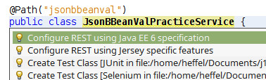

# Bean Validation / JSON-B exercise

## Initial setup

In this exercise, we will use [Bean Validation 2.0](http://beanvalidation.org/) to validate a collection of objects. We will also use [JSON-B](http://json-b.net/) to generate a JSON string from a collection of Java objects.

Start a new Maven project and select *"Web Application"* and give it a meaningful name, ex. *"hol-jsonb-beanval"*, click *"Next"*.

Select *"GlassFish"* as the application server and *"Java EE7 Web"*, we will update the Java EE API version later. Validate and you should now have an empty project.

Select the project's *pom.xml*, under *"Project Files"*. Now you can update the project to use Java EE 8 APIs but just updating the version number of the *<javaee-web-api>* dependency.

```xml
 <dependency>
    <groupId>javax</groupId>
    <artifactId>javaee-api</artifactId>
    <version>8.0</version>
    <scope>provided</scope>
 </dependency>
```

:bulb: This Lab is only using APIs from the Java EE 8 Profile which is a subset of the Full platform.

## Create a JAX-RS Web service

Right click on the project, select *"New"* and *"Java Class"*, enter an appropriate class name, eg. *"JsonBBeanValPracticeService"*. Make sure to specify a package where you code will reside, eg. *"org.j1hol"* then *"finish"*.  

Annotate your class with the `@Path` annotation, specifying an appropriate path for our web service, eg. `@Path("jsonbbeanval")`.

:bulb: Add all missing imports by hitting `CTRL+SHIFT+I`.

NetBeans will warn that REST is not configured, click on the class name and hit `Alt+Enter`, then select "Configure REST using Java EE 6 Specification".



Add a public method named `getJson()` to your class, the method should be public, take no arguments, and return `javax.ws.rs.core.Response`

Annotate your method with the `@GET` annotation to have the method respond to HTTP GET requests.

Annotate your method with the `@Produces` annotation, specifying `MediaType.APPLICATION_JSON` as the value attribute of the annotation.

At this point your method should look like this:

```java
    @GET
    @Produces(MediaType.APPLICATION_JSON)
    public Response getJson() {
    }
```
Add a `Customer` class to your project (Right click on the project, select *"New"* | "*Java Class*"). This class will be used as a Data Transfer Object (DTO), its contents should look as follows (copy/paste into your class):

```java
    package org.j1hol;

    import javax.validation.constraints.NotBlank;
    import javax.validation.constraints.PositiveOrZero;

    public class Customer {

        private String salutation;

        @NotBlank(message = "first name must not be empty")
        private String firstName;
        private String middleName;

        @NotBlank(message = "last name must not be empty")
        private String lastName;

        @PositiveOrZero
        private Integer age;

        public Customer() {
        }

        public Customer(String salutation, String firstName, String middleName, String lastName, Integer age) {
            this.salutation = salutation;
            this.firstName = firstName;
            this.middleName = middleName;
            this.lastName = lastName;
            this.age = age;
        }

        public String getSalutation() {
            return salutation;
        }

        public void setSalutation(String salutation) {
            this.salutation = salutation;
        }

        public String getFirstName() {
            return firstName;
        }

        public void setFirstName(String firstName) {
            this.firstName = firstName;
        }

        public String getMiddleName() {
            return middleName;
        }

        public void setMiddleName(String middleName) {
            this.middleName = middleName;
        }

        public String getLastName() {
            return lastName;
        }

        public void setLastName(String lastName) {
            this.lastName = lastName;
        }

        public Integer getAge() {
            return age;
        }

        public void setAge(Integer age) {
            this.age = age;
        }

    }
```

Add a private variable of type `List` to your class, using generics, specify that the list will accept only insances 